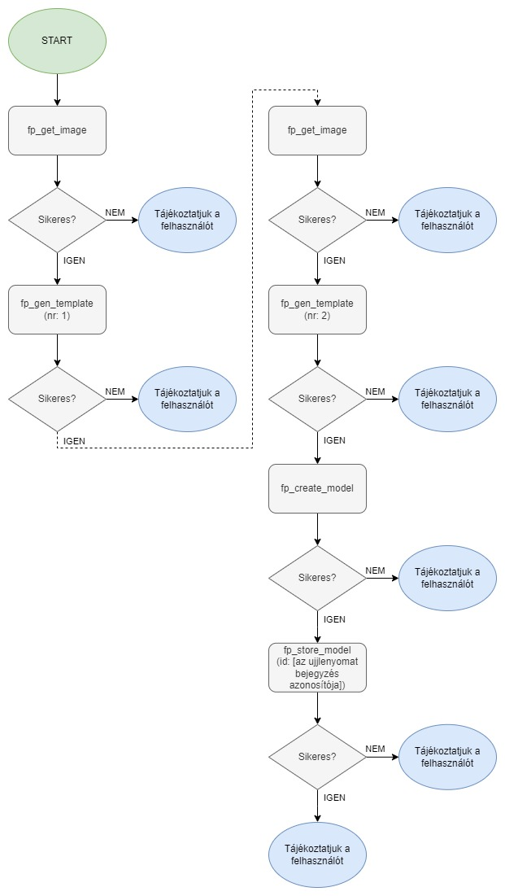

# okos-belepteto-rendszer
Okos, internetre kötött beléptető rendszer Raspberry Pi és Arduino alapokon.

# A rendszer leírása
A projekt céja egy hálózaton keresztül elérhető beléptető rendszer megvalósítása, amely engedélyezi a regisztrált felhasználók számára a belépést RFID kártya segítségével. A biztonság növelése érdekében az RFID kártya leovasását követően a felhasználóknak meg kell adni a saját 4 karakter hosszú PIN kódját és/vagy ujjlenyomat segítségével hitelesíteniük kell magukat. A sikeres belépést LED-ekkel, illetve egy 16x2-es karakteres LCD kijelzővel szemléltetjük. 

# Funkciók

- Az RFID jogosultságokat, illetve a felhasználók más releváns adatait egy adatbázisban tároljuk.
- A sikeres belépést az LCD megjelenő felirattal és hangjelzéssel jelezzük.
- Sikertelen belépésről az LCD tájékoztat minket a következő felirattal.
- A sikeres, illetve a sikertelen kilépési kísérletről egy LED, illetve hangjelzés segítségével tájékoztat a rendszer.

# A rendszer tervezett felépítése


# Felhasznált Hardware elemek
- 1 db Raspberry pi 1b rev.2
- 1 db SY-12W-K típusú relé
- 1 db 16x2-es karakteres LCD kijelzővel
- 1 db 4x4-es gomb mátrix
- 2 db RFID olvasó (MFRC-522)
- 1 db Arduino Nano
- 1 db 3,3-5V szintillesztő
- 1 db TM1650 típusú billenytűzet vezérlő IC
- 1 db AS-608 típusú ujjlenyomat olvasó
- 1 db RGB LED
- 2 db Csipogó hangszóró
- Egyéb kisebb alkatrészek


# A rendszer hardveres felépítése
A rendszer két egymástól jól elkülöníthető, ugyanakkor összekapcsolt hardveres részből áll, melyek a következők:

- Az Arduino mikrovezérlőre épülő, melynek felafata a felhasználók beengedéséért felelős külső RFID olvasó, illetve a hozzá tartozó LCD kijelző, ujjlenyomat olvasó, és számbillentyűzet vezérlése.
- A Rasperry Pi, illetve a hozzákapcsolt hardvare elemek, melynek feladata a teljes rendszert vezérlő Python alapú program futtatása, illetve a belső, a felhasználók kiengedéséért felelős RFID kártyaolvasó működtetése.

A kettő rendszer UART soros interfésszel kommunikál egymással, amely megvalósításához szükséges egy 3,3V-5V szintillesztő áramkör.

A két eszköz összekötéséért felelős kábel bekötése:

| A lábel színe és vastagsága | Funkciója                | Bekötése az Arduino mikrovezérlőn | Bekötése a Raspberry Pi miniszámítógépen | Megjegyzés                                                                                   |
| --------------------------- | ------------------------ | --------------------------------- | ---------------------------------------- | ------------------------------------------------------------------------------------------   |
| Vörös / Vastag              | 5V táp                   | VIN (30)                          | 5V                                       |                                                                                              |
| Fekete / Vastag             | Közös föld               | GND                               | GND                                      |                                                                                              |
| Vörös / Vékony              | NINCS BEKÖTVE            | -                                 | -                                        |                                                                                              |
| Fehér / Vékony              | NINCS BEKÖTVE            | -                                 | -                                        |                                                                                              |
| Zöld / Vékony               | Bejövő UART adatforgalom | TX (1)                            | RxD / GPIO 16 (10)                       | A Raspberry Pi felől nézve, 3,3-5V szintillesztőn keresztül a Rasperry Pi védelme érdekében. |
| Sárga / Vékony              | Kimenő UART adatforgalom | RX (2)                            | TxD / GPIO 15 (8)                        | A Raspberry Pi felől nézve, 3,3-5V szintillesztőn keresztül a Rasperry Pi védelme érdekében. |

## Az Arduino alapú külső olvasó

### Az külső olvasó rövid leírása

A külső olvasó egy Arduino mikrokontroller által vezérelt panel, amelyre csatlakozik a 1602-es LCD kijelző, a kódbillentyűzet, a kártyaolvasó, illetve egy kis hangszóró, amely segítségével a felhasználónak visszajelzést adhatunk a kártya beolvasása során.
A kommunikáció a központi egység és a külső olvasó között soros interfészen valósul meg, az Ardunio, illetve a Raspberry Pi megfelelő lábainak felhasználásával, illetve egy szintillesztő modul közbeikatatásával. A szintillesztő modulra azért van szükség, mert az Arduino a kommunikáció során 5V-os jelszintet használ, míg a Raspberry Pi 3,3V-osat, ezért ha két eszközt közvetlenül csatlakozatnánk, akkor Rasberry Pi károsodna.

### A külső olvasót tartalmazó PCB kivezetései (táblázat)

| Csatlakozás megnevezése                | A panel/mikrovezérlő kivezetése | A panelhez csatlakozó modul kivezetése | Megjegyzés |
| -------------------------------------- | ------------------------------- | -------------------------------------- | ---------- |
| LCD A kijelző adat kábelei             | A4 (23)                         | SDA                                    |            |
|                                        | A5 (24)                         | SCL                                    |            |
| LCD kijelző táp kábelei                | 5V                              | VCC                                    |            |
|                                        | GND                             | GND                                    |            |
| MFRC-522 RFID olvasó adat kábelei      | D10 (13)                        | SDA                                    |            |
|                                        | D11 (14)                        | MOSI                                   |            |
|                                        | D12 (15)                        | MISO                                   |            |
|                                        | D13 (16)                        | SCK                                    |            |
| MFRC-522 RFID olvasó táp kábelei       | 3,3V                            | 3,3V                                   |            |
|                                        | GND                             | GND                                    |            |
| AS-608 ujjlenyomat olvasó adat kábelei | D2 (5)                          | TX                                     |            |
|                                        | D3 (6)                          | RX                                     |            |
| AS-608 ujjlenyomat olvasó táp kábelei  | 3,3V                            | VCC                                    |            |
|                                        | GND                             | GND                                    |            |

### Az olvasó felépítése (Csatlakozók nélkül)


### Az olvasó kapcsolási rajza (Csatlakozók nélkül)


### Az olvasó nyomtatott áramköri lap terve


### Az új ujjlenyomat felvételének folyamata



### Az ujjlenyomat keresésének folyamata


### A külső olvasó kommunikációja a központi egységgel

A központi egységgel történő kommunikáláshoz [JSON](https://www.w3schools.com/js/js_json_intro.asp) adatszerkezetet használunk, ami így néz ki (ez az adatszerkezet csak minta, a program már nem tartalmazza):

    {
        "key": "show_unknown_card_message"
    }

#### Az adatszerkezetben használt mezők jelentése, rövid leírása:

A jelenlegi adatszerkezetben a "key" nevű mező adja meg a konkrét utasítást, illetve az olvasó felől bejövő adat típusát. A további mezők neve az adott üzenet tartalmától függ.

> **Megjegyzés:** A későbbiekben ez az adatszerkezet a kialakuló igényeknek megfelelően változhat. A változások is majd megtalálhatóak lesznek ebben a dokumentációban.

#### A kommunikáció során használható utasítások, események, a hozzájuk rendelt adatszerkezettel

##### Kártya detektálva üzenet

Ez az üzenet akkor érkezik az olvasó felől, ha egy RFID kártyát hozzá éritettek a leolvasóhoz és az olvasó sikeresen beolvasta a kártya egyedi azonosítóját (UID). Az adatszerkezet a következőképp néz ki:

    {
        "key":"card_detected",
        "uid":"d354ca2e"
    }

##### Kód megadva üzenet

Ez az üzenet akkor érkezik az olvasó felől, ha előzőleg kértük az olvasótól a kód bekérését, és a felhasználó beírta. Az adatszerkezet a következőképp néz ki:

    {
        "key":"code_given",
        "code":[a felhasználó által megadott kód]
    }

##### Az ujjlenyomatolvasással kapcsolatos válasz üzenet

Az ujjlenyomatolvasással kapcsolatos üzenetek válasz üzenete az ujjlenyomat keresés kivételével a következőképp néz ki:

    {
        "key":"fp_done",
        "status": [a művelet sikerességét kifejező numerikus érték]
    }

> **Az ujjlenyomat keresés esetén pedig a "status" helyett "finger" mezőt kapunk, amennyiben a keresés művelet sikeres, akkor megkapjuk az adott ujjlenyomat azonosítóját, egyébként "-1" értéket kapunk vissza.**

##### Kód bekérése

Ha ennek az üzenetnek küldjük az adatszerkezetét az olvasó felé, akkor az bekéri a felhasználótól a kódot, és válaszként visszaküldi egy ["Kód megadva üzenet"](#kód-megadva-esemény) formájában. Az üzenet adatszerkezete a következőképp néz ki:

    {
        "key":"get_code"
    }

##### Tetszőleges szöveg kiírása a kijelzőre

Ha ennek az üzenetnek küldjök az adatszerkezetét az olvasó felé, akkor az LCD kijelzőn tetszőleges feliratokat tudunk megjeleníteni (ékezetes karakterek nélkül!). Az üzenet adatszerkezete a következőképp néz ki:

    {
        "key":"lcd_send_str",
        "str":"[tetszőleges szöveg]"
    }
    
##### Kijelző tartalmának törlése

Ezzel az üzenettel a kijelző tartalmát tudjuk letörölni. Az adatszerkezete a következő:

    {
        "key":"lcd_cls"
    }

##### Tetszőleges helyre ugrás a kurzorral

Ezzel az üzenettel tetszőleges helyre pozicionálhatjuk a kijelző kurzorát. Az adatszerkezete a következő:

    {
        "key":"lcd_goto",
        "row":[sorszám]
        "column":[oszlopszám]
    }

> **Megjegyzés**: Az oszlopszámhoz, illetve a sorszámhoz integer típusú értéket kell írni, különben az üzenet nem fog működni!

##### Software reset végrehajtása

Ha ennek az üzenetnek küldjük az adatszerkezetét az olvasó felé, akkor az Arduino-n szoftveres újraindítást hajtunk végre. Ez a funkció akkor lehet hasznos, ha ha az Arduino valamilyen okból kifolyólag rendellenes tevékenységeket végez. Az üzenet adatszerkezete a következőképp néz ki:

    {
        "key":"sw_rst"
    }
    
##### Képalkotás ujjlenyomatolvasó használatával

Ezen üzenet elküldésével, egy ujjlenyomatképet tudunk rögzíteni.

    {     
        "key": "fp_get_image",
    }

##### Sablon generálás ujjlenyomatolvasó használatával

Ezen üzenet elküldésével, egy ujjlenyomat sablont tudunk generálni.

    {     
        "key": "fp_gen_template",
        "nr": [a sablont tároló buffer azonosítója],
    }

##### Model készítés ujjlenyomatolvasó használatával

Ezen üzenet elküldésével, egy ujjlenyomat modelt tudunk készíteni.

    {     
        "key": "fp_create_model",
    }

##### Model tárolása ujjlenyomatolvasó használatával

Ezen üzenet elküldésével, egy ujjlenyomat modelt tudunk tárolni.

    {     
        "key": "fp_store_model",
        "id": [az ujjlenyomat bejegyzés azonosítója],
    }

##### Ujjlenyomat azonosító keresése az ujjlenyomat olvasó használatával

Ezen üzenet elküldésével, egy ujjlenyomat modelt tudunk tárolni.

    {     
        "key": "fp_search",
    }

## A Raspberry Pi alapú belső olvasó

A Raspberry Pi alapú belső olvasó egy Raspbery Pi 1 rev.2 miniszámítógépen alapul, mely futtat egy Python 3 nyelven írt programot, ami a felhasználók PHP backendenden történő hitelesítéséért felel. Ez a program vezérli a külső olvasót is JSON adatszerkezetek segítségével.

### A belső olvasót tartalmazó PCB kivezetései (táblázat)

| Csatlakozás megnevezése                | A panel/miniszámítógép kivezetése | A panelhez csatlakozó modul kivezetése | Megjegyzés |
| -------------------------------------- | --------------------------------- | -------------------------------------- | ---------- |
| MFRC-522 RFID olvasó adat kábelei      | MOSI/GPIO10 (19)                  | MOSI                                   |            |
|                                        | MISO/GPIO9 (21)                   | MISO                                   |            |
|                                        | SCLK/GPIO11 (23)                  | SCK                                    |            |
|                                        | CE0/GPIO8 (24)                    | SDA                                    |            |
| MFRC-522 RFID olvasó táp kábelei       | 3,3V                              | 3,3V                                   |            |
|                                        | GND                               | GND                                    |            |

### Az olvasó kapcsolási rajza (Csatlakozók nélkül)


### Az olvasó nyomtatott áramköri terve


# A rendszer szoftveres felépítése

A rendszer szoftveresen a következő három részből áll:
 - Laravel PHP keretrendszer alapú webalkalmazás: Ez a web alkalmazás felelős a felhasználók hitelesítéséért, illetve a webes adminfelületért.
 - A belső olvasón futtatandó Python nyelvű program: Ez felelős a felhasználók hitelesítéssért, illetve az RFID olvasók vezérlésséért.
- Az Arduino Mikrokontrolleren futtatot kód: Ezt a programot vezérli a Python kód és ezáltal a mikrovezérlőre kapcsolt LCD kijelzőt, kódbillentyűzetet és RFID olvasót éri el.

## A Laravel PHP keretrendszer alapú webalkalmazás

### A projekt adatbázis modelljének felépítése
#### History model

A History model a következő attribútumokat tartalmazza:
- arriveTime: A felhasználó beléptetőrenszeren keresztüli objektumba való belépésének időpontja.
- successful: A felhasználó objektumba történő belépésének sikersségét rögzítő attribútum.
- leaveTime: A felhasználó beléptetőrenszeren keresztüli objektumból való kilépésének időpontja.
- workTime: A felhasználó objetumban töltött ideje, az arriveTime és leaveTime különbsége.
- direction: A ki/be léptetés iránya.
- userId: Az érintett felhasználó azonosítója.
- cardId: A belépéshez használt kártya azonosítója.

#### User model

A User model a következő attribútumokat tartalmazza:
- name: Az érintett felhasználó neve.
- picture: Az érintett felhasználó profilképe.
- code: Az érintett felhsználó belépési kódja.
- fingerprint: Az érintett felhasználó ujjlenyomata.
- language: Az érintett felhasználó nyelvi beállítása.
- profile: Az adott felhasználó profilja.
- role: Az adott felhasználó jogosultásgi szintje, szerepköre.
- isEntryEnabled: Az adott felhasználó rendelkezik-e az objektumba történő belépés jogosultsággával?
- email: Az érintett felhasználó email címe.
- password: Az érintett felhasználó jelszava titkosítva.
- remember_token: A felhasználó megjegyzéséért felelős token a Laravel keretrendszerben.
- cardId: Az érintett felhasználó beléppését biztosító kártya azonosítója.
- isHere: A felhasználó ittlétét tároló attribútum.
- email_verified_at: Az email cím visszaigazolásának időpontja.

#### Settings model

A Settings model a következő attribútumokat tartalmazza:
- setting_name: A beállítás neve.
- setting_value: A beállítás értéke.


### A projektben használt útvonalak
- `/`: Az oldal kiindulópontja, a dashboard.blade.php nézetet hívja meg. (Ideiglenesen át van írányítva a /users-re)
- `/logs`: Az oldalon, illetve a beléptetés során történő esetleges események visszanézhetőségét biztosító oldal, a logs.blade.php nézetet hívja meg.
- `/users`: Az oldal felhasználó kezezelését biztosító oldala, az UsersViewController index() metódusát hívja meg.
- `/users/add`: Az oldal felhasználók hozzáadását biztosító oldala, az UsersViewController add() metódusát hívja meg.
- `/users/edit/{userId}`: Az oldal felhasználók módosítását biztosító oldala, az UsersViewController edit() metódusát hívja meg.
- `/users/delete/{userId}`: Az oldal felhasználók hozzáadását biztosító oldala, az UsersViewController delete() metódusát hívja meg.
- `/current`: A legutóbbi belépési kísérletet mutató nézet elérési útja.
- `/api/validation/validate`: Az authentikációra szolgáló útvonal, a ValidationController validate() metódusát hívja meg.
- `/api/validation/get-methods`: Az authentikációs metódusokat lekérdezó útvonal, a ValidationController getMethods() metódusát hívja meg.
- `/log`: Egy adott belépési kísérlet sikerességének mentésére szolgló útvonal.
- `/setup`: Majd az eszköz beállításra fog szolgálni, de még fejlesztés alatt..

### A projektben használt Laravel Controllerek
- UsersViewController: A felhasználókkal kapcsolatos műveletekért felelős vezérlő.
- ValidationController: Az authentikációért felelős vezérlő.

### A web backend telepítése Docker segítségével

0. Telepítsd a Docker Desktop alkalmazást, amennyiben nem található meg a számítógépeden, az alkalmazás innen tölthető le [https://www.docker.com/products/docker-desktop/](https://www.docker.com/products/docker-desktop/)

1. Indítsd el a Docker Desktop alkalmazást amennyiben nem futna.

2. Lépj a projekt `/backend/.docker` mappájába!

3. A megfelelő docker konténerek telepítéséhez add ki a következő parancsot:
```
docker-compose up
```
4. A `/backend` mappában a Docker Desktop segítségével futtasd a következő parancsot az adatbázis migrációk alkalmazásához:
```
php artisan migrate
```
5. Hozzuk létre a kezdeti beállításokat a következő paranccsal:
```
php artisan app:generate-default-settings
```
6. Hozzuk létre a kezdeti felhasználót a következő paranccsal:
```
php artisan app:create-first-user
```
**Megjegyzés:** Amennyiben paraméterként mást nem adunk meg, úgy az alapértelmezett belépési adatok a következők lesznek:
  - email: admin@admin.com
  - jelszó: jelszo

**Megjegyzés:** Amennyiben a helyi, fejlesztői gépen futtatod a Laravel keretrendszert, abban az esetben a sikeres telepítést követően a következő címen lesz elérhető az oldal: `127.0.0.1:8000`.

# Felhasznált software eszközök

## A projekt frontendjének kialakítására használt külső könyvtárak
- https://github.com/lipis/flag-icons
- Bootstrap
- Bootstrap icons

## A projekt során használt Laravel modulok
- laravel/fortify a felhasználók webes felületen történő hitelesítéséhez.
- yoeriboven/laravel-log-db az adatbázisban történő logoláshoz.


## Az Arudino programhoz felhasznált külső könyvtárak:

- HD44780_LCD_PCF8574 i2c LCD controller library - https://github.com/gavinlyonsrepo/HD44780_LCD_PCF8574
- MFRC522v2 library - https://github.com/OSSLibraries/Arduino_MFRC522v2
- ArdunioJSON - https://arduinojson.org/
- Adafruit fingerprint libary - https://github.com/adafruit/Adafruit-Fingerprint-Sensor-Library/
- TM16xx libary - https://github.com/maxint-rd/TM16xx/

- A Raspberry Pi-n található vezérlő szoftvert Python programozási nyelv segítségével fejlesztettük le, ez a szoftver kommunikál a Laravel alapú PHP backenddel REST API segítségével.
- pip
- gpio
- phpmyadmin


  A Python-hoz használt külső könyvtárak:
  - pyserial

  ## A dokumentáció írása során felhasznált források
- [https://hub.docker.com/r/bitnami/laravel](https://hub.docker.com/r/bitnami/laravel)

