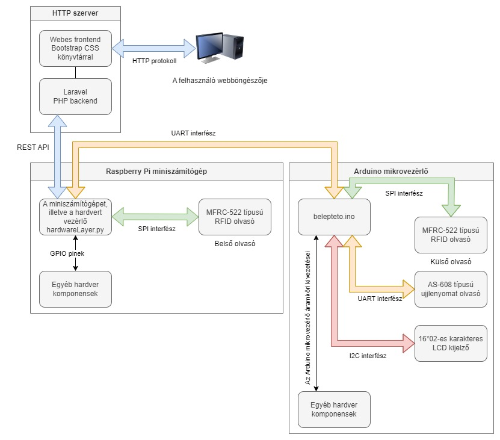

# okos-belepteto-rendszer
Okos, internetre kötött beléptető rendszer Raspberry Pi és Arduino alapokon.

# A rendszer leírása
A projekt céja egy hálózaton keresztül elérhető beléptető rendszer megvalósítása, amely engedélyezi a regisztrált ügyfelek számára a belépést RFID kártya segítségével. A biztonság növelése érdekében az RFID kártya leovasását követően a felkasználónak meg kell adni a saját 4 karakter hosszú PIN kódját. A sikeres belépést LED-ekkel, illetve egy 16x2-es karakteres LCD kijelzővel szemléltetjük. 

# Felhasznált Hardware elemek
- 1 db Raspberry pi 1b rev.2
- 1 db 4 csatornás relé (MSP430)
- 1 db 16x2-es karakteres LCD kijelzővel
- 1 db 4x4-es gomb mátrix
- 2 db RFID olvasó (MFRC-522)
- 1 db Ardiono Nano
- 1 db 3,3-5V szintillesztő
- 1 db RGB LED
- 2 db Csipogó hangszóró
- Egyéb kisebb alkatrészek

# A rendszer tervezett felépítése

# A külső olvasó bekötési rajza

# Funkciók

- Az RFID jogosultságokat, illetve a felhasználók más releváns adatait egy adatbázisban tároljuk.
- A sikeres belépést az LCD megjelenő felirattal és hangjelzéssel jelezzük.
- Sikertelen belépésről az LCD tájékoztat minket a következő felirattal.
- A sikeres, illetve a sikertelen kilépési kísérletről egy LED, illetve hangjelzés segítségével tájékoztat a rendszer.

# Felhasznált software eszközök

- A Raspberry Pi-n található vezérlő szoftvert Python programozási nyelv segítségével fejlesztettük le, ez a szoftver kommunikál a Laravel alapú PHP backenddel REST API segítségével.
- pip
- gpio
- phpmyadmin
- Az Arudino programhoz felhasznált külső könyvtárak:

  - Arduino Keypad library - https://playground.arduino.cc/Code/Keypad/
  - HD44780_LCD_PCF8574 i2c LCD controller library - https://github.com/gavinlyonsrepo/HD44780_LCD_PCF8574
  - MFRC522v2 library - https://github.com/OSSLibraries/Arduino_MFRC522v2
  - ArdunioJSON - https://arduinojson.org/

  A Python-hoz használt külső könyvtárak:

  - pyserial

