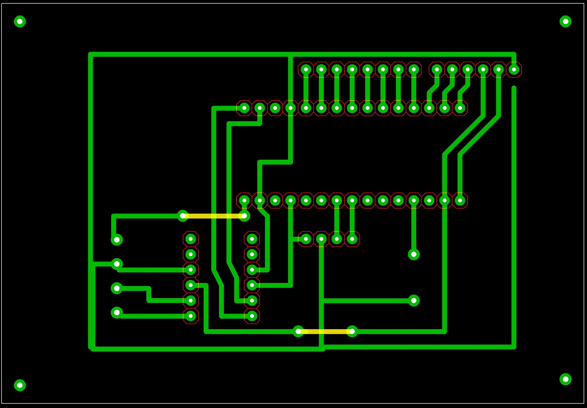

# Az Arduino alapú külső kártyaolvasó dokumentációja

Jelen dokumentációban leírom az Arduino vezérlésű külső kártyaolvasó modul működését, és a fontosabb tudnivalókat róla.

## Az külső olvasó rövid leírása

A külső olvasó egy Arduino mikrokontroller által vezérelt panel, amelyre csatlakozik a 1602-es LCD kijelző, a kódbillentyűzet, a kártyaolvasó, illetve egy kis hangszóró, amely segítségével a felhasználónak visszajelzést adhatunk a kártya beolvasása során.
A kommunikáció a központi egység és a külső olvasó között soros interfészen valósul meg, az Ardunio, illetve a Raspberry Pi megfelelő lábainak felhasználásával, illetve egy szintillesztő modul közbeikatatásával. A szintillesztő modulra azért van szükség, mert az Arduino a kommunikáció során 5V-os jelszintet használ, míg a Raspberry Pi 3,3V-osat, ezért ha két eszközt közvetlenül csatlakozatnánk, akkor Rasberry Pi károsodna.

## Az olvasó felépítése (Csatlakozók nélkül)

## Az olvasó kapcsolási rajza (Csatlakozók nélkül)

## Az olvasó nyomtatott áramköri lap terve

## A külső olvasó kommunikációja a központi egységgel

A központi egységgel történő kommunikáláshoz [JSON](https://www.w3schools.com/js/js_json_intro.asp) adatszerkezetet használunk, ami így néz ki (ez az adatszerkezet csak minta, a program már nem tartalmazza):

    {
        "type": "action",
        "action": "show_unknown_card_message"
    }

### Az adatszerkezetben használt mezők jelentése, rövid leírása:

Jelenleg az adatszerkezetben a `type` mező kötelező, azaz minden elküldött adatszerkezetnek tartalmazia kell! A `type` mező két értéket vehet fel az `action`-t, illetve at `event`-et. Az `action` értéket akkor veszi fel, ha a központ felől kommunikálunk az olvasó felé. Az `event` értéket pedig akkor veszi fel, ha az olvasó felől kommunikállunk a központi egység felé. Az előbb kifejtett mezőn kívül az átküldött adatszerkezetnek tartalmaznia kell még egy `action` vagy `event` mezőt, a kommunikáció irányának függvényében.

**Megjegyzés:** A későbbiekben ez az adatszerkezet a kialakuló igényeknek megfelelően változhat. A változások is majd megtalálhatóak lesznek ebben a dokumentációban.

### A kommunikáció során használható utasítások, események, a hozzájuk rendelt adatszerkezettel

#### Kártya detektálva esemény

Ez az esemény akkor érkezik az olvasó felől, ha egy RFID kártyát hozzá éritettek a leolvasóhoz és az olvasó sikeresen beolvasta a kártya egyedi azonosítóját (UID). Az esemény adatszerkezete a következőképp néz ki:

    {
        "type":"event",
        "event":"card_detected",
        "uid":"d354ca2e"
    }

#### Kód megadva esemény

Ez az esemény akkor érkezik az olvasó felől, ha előzőleg kértük az olvasótól a kód bekérését, és a felhasználó beírta. Az esemény adatszerkezete a következőképp néz ki:

    {
        "type":"event",
        "event":"code_given",
        "code":1234
    }

#### Kód bekérése

Ha ennek az akciónak küldjük az adatszerkezetét az olvasó felé, akkor az bekéri a felhasználótól a kódot, és válaszként visszaküldi egy "Kód megadva esemény" formájában. Az akció adatszerkezete a következőképp néz ki:

    {
        "type":"action",
        "action":"get_code"
    }

#### Tetszőleges szöveg kiírása a kijelzőre

Ha ennek az akciónak küldjök az adatszerkezetét az olvasó felé, akkor az LCD kijelzőn tetszőleges feliratokat tudunk megjeleníteni (ékezetes karakterek nélkül!). Az akció adatszerkezete a következőképp néz ki:

    {
        "type":"action",
        "action":"lcd_send_string",
        "string":"[tetszőleges szöveg]"
    }
    
#### Kijelző tartalmának törlése

Ezzel az akcióval a kijelző tartalmát tudjuk letörölni. Az adatszerkezete a következő:

    {
        "type":"action",
        "action":"lcd_clear_screen"
    }

#### Tetszőleges helyre ugrás a kurzorral

Ezzel az akcióval tetszőleges helyre pozicionálhatjuk a kijelző kurzorát. Az adatszerkezete a következő:

    {
        "type":"action",
        "action":"lcd_goto",
        "row":[sorszám]
        "column":[oszlopszám]
    }

**Megjegyzés**: Az oszlopszámhoz, illetve a sorszámhoz integer típusú értéket kell írni, különben az akció nem fog működni!

#### Software reset végrehajtása

Ha ennek az akciónak küldjük az adatszerkezetét az olvasó felé, akkor az Arduino-n szoftveres újraindítást hajtunk végre. Ez a funkció akkor lehet hasznos, ha ha az Arduino valamilyen okból kifolyólag rendellenes tevékenységeket végez. Az akció adatszerkezete a következőképp néz ki:

    {
        "type":"action",
        "action":"soft_reset"
    }
    
#### Hang lejátszása hangszórón

Ezen akció meghívásával, egy tetszőleges frekvenciájú és idejű hangot tudunk lejátszani.

    {     
        "type": "action",
        "action": "custom_beep",
        "frequency": [frekvencia (Hz)],
        "delay": [időbeli hosszúság (ms)]
    }
