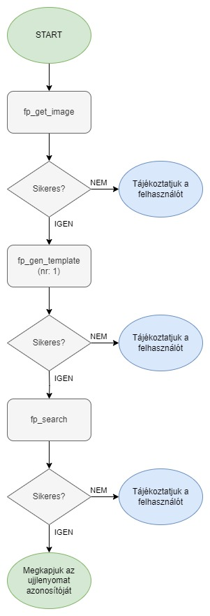

# Az Arduino alapú külső kártyaolvasó dokumentációja

Jelen dokumentációban leírom az Arduino vezérlésű külső kártyaolvasó modul működését, és a fontosabb tudnivalókat róla.

## Az külső olvasó rövid leírása

A külső olvasó egy Arduino mikrokontroller által vezérelt panel, amelyre csatlakozik a 1602-es LCD kijelző, a kódbillentyűzet, a kártyaolvasó, illetve egy kis hangszóró, amely segítségével a felhasználónak visszajelzést adhatunk a kártya beolvasása során.
A kommunikáció a központi egység és a külső olvasó között soros interfészen valósul meg, az Ardunio, illetve a Raspberry Pi megfelelő lábainak felhasználásával, illetve egy szintillesztő modul közbeikatatásával. A szintillesztő modulra azért van szükség, mert az Arduino a kommunikáció során 5V-os jelszintet használ, míg a Raspberry Pi 3,3V-osat, ezért ha két eszközt közvetlenül csatlakozatnánk, akkor Rasberry Pi károsodna.

## Az olvasó felépítése (Csatlakozók nélkül)

## Az olvasó kapcsolási rajza (Csatlakozók nélkül)

## Az olvasó nyomtatott áramköri lap terve

## Az új ujjlenyomat felvételének folyamata

## Az ujjlenyomat keresésének folyamata

## A külső olvasó kommunikációja a központi egységgel

A központi egységgel történő kommunikáláshoz [JSON](https://www.w3schools.com/js/js_json_intro.asp) adatszerkezetet használunk, ami így néz ki (ez az adatszerkezet csak minta, a program már nem tartalmazza):

    {
        "key": "show_unknown_card_message"
    }

### Az adatszerkezetben használt mezők jelentése, rövid leírása:

A jelenlegi adatszerkezetben a "key" nevű mező adja meg a konkrét utasítást, illetve az olvasó felől bejövő adat típusát. A további mezők neve az adott üzenet tartalmától függ.

> **Megjegyzés:** A későbbiekben ez az adatszerkezet a kialakuló igényeknek megfelelően változhat. A változások is majd megtalálhatóak lesznek ebben a dokumentációban.

### A kommunikáció során használható utasítások, események, a hozzájuk rendelt adatszerkezettel

#### Kártya detektálva üzenet

Ez az üzenet akkor érkezik az olvasó felől, ha egy RFID kártyát hozzá éritettek a leolvasóhoz és az olvasó sikeresen beolvasta a kártya egyedi azonosítóját (UID). Az adatszerkezet a következőképp néz ki:

    {
        "key":"card_detected",
        "uid":"d354ca2e"
    }

#### Kód megadva üzenet

Ez az üzenet akkor érkezik az olvasó felől, ha előzőleg kértük az olvasótól a kód bekérését, és a felhasználó beírta. Az adatszerkezet a következőképp néz ki:

    {
        "key":"code_given",
        "code":[a felhasználó által megadott kód]
    }

#### Az ujjlenyomatolvasással kapcsolatos válasz üzenet

Az ujjlenyomatolvasással kapcsolatos üzenetek válasz üzenete az ujjlenyomat keresés kivételével a következőképp néz ki:

    {
        "key":"fp_done",
        "status": [a művelet sikerességét kifejező numerikus érték]
    }

> **Az ujjlenyomat keresés esetén pedig a "status" helyett "finger" mezőt kapunk, amennyiben a keresés művelet sikeres, akkor megkapjuk az adott ujjlenyomat azonosítóját, egyébként "-1" értéket kapunk vissza.**

#### Kód bekérése

Ha ennek az üzenetnek küldjük az adatszerkezetét az olvasó felé, akkor az bekéri a felhasználótól a kódot, és válaszként visszaküldi egy ["Kód megadva üzenet"](#kód-megadva-esemény) formájában. Az üzenet adatszerkezete a következőképp néz ki:

    {
        "key":"get_code"
    }

#### Tetszőleges szöveg kiírása a kijelzőre

Ha ennek az üzenetnek küldjök az adatszerkezetét az olvasó felé, akkor az LCD kijelzőn tetszőleges feliratokat tudunk megjeleníteni (ékezetes karakterek nélkül!). Az üzenet adatszerkezete a következőképp néz ki:

    {
        "key":"lcd_send_str",
        "str":"[tetszőleges szöveg]"
    }
    
#### Kijelző tartalmának törlése

Ezzel az üzenettel a kijelző tartalmát tudjuk letörölni. Az adatszerkezete a következő:

    {
        "key":"lcd_cls"
    }

#### Tetszőleges helyre ugrás a kurzorral

Ezzel az üzenettel tetszőleges helyre pozicionálhatjuk a kijelző kurzorát. Az adatszerkezete a következő:

    {
        "key":"lcd_goto",
        "row":[sorszám]
        "column":[oszlopszám]
    }

> **Megjegyzés**: Az oszlopszámhoz, illetve a sorszámhoz integer típusú értéket kell írni, különben az üzenet nem fog működni!

#### Software reset végrehajtása

Ha ennek az üzenetnek küldjük az adatszerkezetét az olvasó felé, akkor az Arduino-n szoftveres újraindítást hajtunk végre. Ez a funkció akkor lehet hasznos, ha ha az Arduino valamilyen okból kifolyólag rendellenes tevékenységeket végez. Az üzenet adatszerkezete a következőképp néz ki:

    {
        "key":"sw_rst"
    }
    
#### Képalkotás ujjlenyomatolvasó használatával

Ezen üzenet elküldésével, egy ujjlenyomatképet tudunk rögzíteni.

    {     
        "key": "fp_get_image",
    }

#### Sablon generálás ujjlenyomatolvasó használatával

Ezen üzenet elküldésével, egy ujjlenyomat sablont tudunk generálni.

    {     
        "key": "fp_gen_template",
        "nr": [a sablont tároló buffer azonosítója],
    }

#### Model készítés ujjlenyomatolvasó használatával

Ezen üzenet elküldésével, egy ujjlenyomat modelt tudunk készíteni.

    {     
        "key": "fp_create_model",
    }

#### Model tárolása ujjlenyomatolvasó használatával

Ezen üzenet elküldésével, egy ujjlenyomat modelt tudunk tárolni.

    {     
        "key": "fp_store_model",
        "id": [az ujjlenyomat bejegyzés azonosítója],
    }

#### Ujjlenyomat azonosító keresése az ujjlenyomat olvasó használatával

Ezen üzenet elküldésével, egy ujjlenyomat modelt tudunk tárolni.

    {     
        "key": "fp_search",
    }
